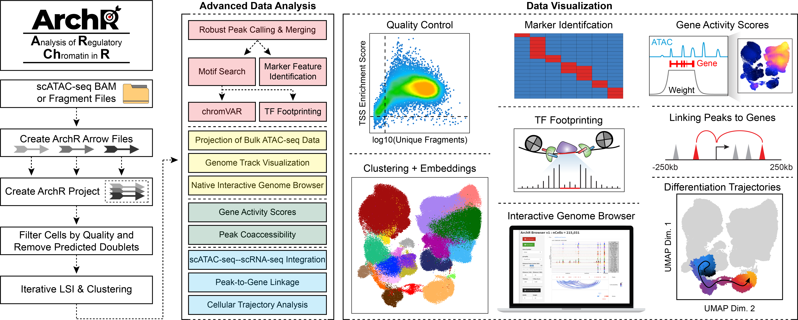

<p align="center"><a href ="https://www.archrproject.com"></a></p>
<hr>

[](https://www.tidyverse.org/lifecycle/#maturing)

### ArchR has new features available for scATAC-seq Analysis

**Paired scATAC-seq and scRNA-seq Analysis**

ArchR now supports paired scATAC-seq and scRNA-seq Analysis! <br />
&nbsp;&nbsp;&nbsp;&nbsp;&nbsp;&nbsp;See updates with importFeatureMatrix, addGeneExpressionMatrix, addIterativeLSI, addCombinedDims <br />
&nbsp;&nbsp;&nbsp;&nbsp;&nbsp;&nbsp;For a brief tutorial of these features : https://greenleaflab.github.io/ArchR_2020/Ex-Analyze-Multiome.html

**Trajectory Analysis**

ArchR now directly supports both monocle3 and Slingshot based trajectory analysis! <br />
&nbsp;&nbsp;&nbsp;&nbsp;&nbsp;&nbsp;See updates with getMonocleTrajectories, addMonocleTrajectory, addSlingShotTrajectories <br />
&nbsp;&nbsp;&nbsp;&nbsp;&nbsp;&nbsp;For a brief tutorial of these features : https://greenleaflab.github.io/ArchR_2020/Ex-Analyze-Trajectory.html

Additionally ArchR now enables export of a peak matrix that is compatible with STREAM!<br />
&nbsp;&nbsp;&nbsp;&nbsp;&nbsp;&nbsp;See updates with exportPeakMatrixForSTREAM <br />

### ArchR is currently in Beta and will be in active development through the peer review process.

ArchR is a full-featured R package for processing and analyzing single-cell ATAC-seq data. ArchR provides the most extensive suite of scATAC-seq analysis tools of any software available. Additionally, ArchR excels in both speed and resource usage, making it possible to analyze 1 million cells in 8 hours on a MacBook Pro laptop.

### For installation instructions and full documentation, visit www.ArchRProject.com.

<hr>



# Quick Installation of ArchR
For a full walk through of installation and frequently related issues please visit www.ArchRProject.com.

**First, install devtools (for installing GitHub packages) if it isn't already installed:**
``` r
if (!requireNamespace("devtools", quietly = TRUE)) install.packages("devtools")
```

**Then, install BiocManager (for installing bioconductor packages) if it isn't already installed:**
``` r
if (!requireNamespace("BiocManager", quietly = TRUE)) install.packages("BiocManager")
```

**Then, install ArchR:**
``` r
devtools::install_github("GreenleafLab/ArchR", ref="master", repos = BiocManager::repositories())
```

**Lastly, install all of the ArchR dependencies that aren't installed by default:**
``` r
library(ArchR)
ArchR::installExtraPackages()
```
If any of these steps fails, you should identify the offending package and troubleshoot that individual installation before proceeding. Additionally, please see the ArchR website (www.ArchRProject.com) where we have installation troubleshooting tips.

# Issues using ArchR?

ArchR is currently in __beta__. We expect there to be bumps in the road. If you think you have found a bug, please first install the latest version of ArchR via
``` r
devtools::install_github("GreenleafLab/ArchR", ref="master", repos = BiocManager::repositories())
```
If this does not fix your problem, please [report an issue on Github](https://github.com/GreenleafLab/ArchR/issues) with the __Bug Report__ form.

If you have questions about ArchR usage, please refer to the [the searchable full user's manual](https://www.archrproject.com/bookdown/index.html), [the FAQ section](https://www.archrproject.com/articles/Articles/faq.html), and the [publication](https://greenleaf.stanford.edu/assets/pdf/). If you think the documentation on this website or in the function annotations is unclear, please [submit an issue on Github](https://github.com/GreenleafLab/ArchR/issues) with the __Documentation Request__ form. If there is a feature that you think is missing from ArchR _and you have already searched the user's manual_, [submit an issue on Github](https://github.com/GreenleafLab/ArchR/issues) with the __Feature Request__ form. If none of these options help, [send us an email](mailto:archr.devs@gmail.com). We will do our best to respond to questions that are not otherwise answered in the documentation.


