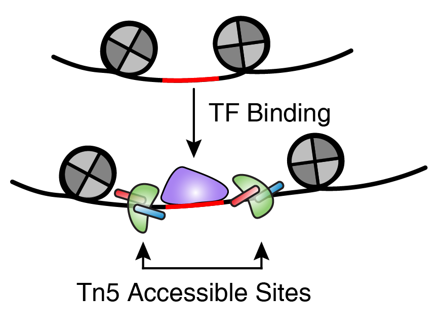
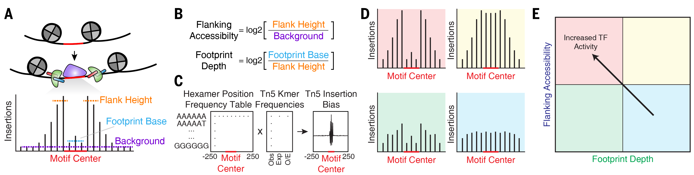

```{r image, include=FALSE}
knitr::include_graphics(c("../../images/footprintingSchematic.png","../../images/footprintingMethods.png"))
```

Transcription factor (TF) footprinting allows for the prediction of the precise binding location of a TF at a particular locus. This is because the DNA bases that are bound by the TF are actually protected from transposition while the DNA bases immediately adjacent to TF binding are accessible.

{width=250px}

Ideally, TF footprinting is performed at a single site to determine the precise binding location of the TF. However, in practice, this requires very high sequencing depth, often much higher depth than what most users would obtain from either bulk or single-cell ATAC-seq. To get around this problem, we can combine Tn5 insertion locations across many instances of predicted TF binding. For example, we can take all peaks that harbor a CTCF motif and make an aggregate TF footprint for CTCF across the whole genome.

[INSERT CTCF FOOTPRINT EXAMPLE]

The accuracy of this footprint relies on generating a reliable curated list of predicted binding sites for the TF of interest. ArchR does this in a naive way via the `addMotifAnnotations()` functions by searching the peak region for any DNA sequence matching a motif. Depending on the degeneracy of the motif of interest, this may or may not be sufficient. These motif annotations get added to the __QQQArchRProject???__ as a binary representation on a per peak basis (0 = no motif, 1 = motif present). Once you have these motif annotations, ArchR performs footprinting using the `plotFootprints()` function which takes as input an `ArchRProject` object and a `GenomicRanges` object that contains the positions of the motifs. These positions can be accessed from the `ArchRProject` via the `getPositions()` function.

Perhaps most importantly, the footprinting analyses in ArchR account for known Tn5 insertion sequence bias.To do this, ArchR uses a matrix of hexamer position frequencies and a matrix of k-mer frequencies at Tn5 insertion sites:

{width=1000px}

All put together, the `plotFootprints()` function generates footprint plots that take into account Tn5 insertion bias.

[INSERT EXAMPLE FOOTPRINT PLOT]
