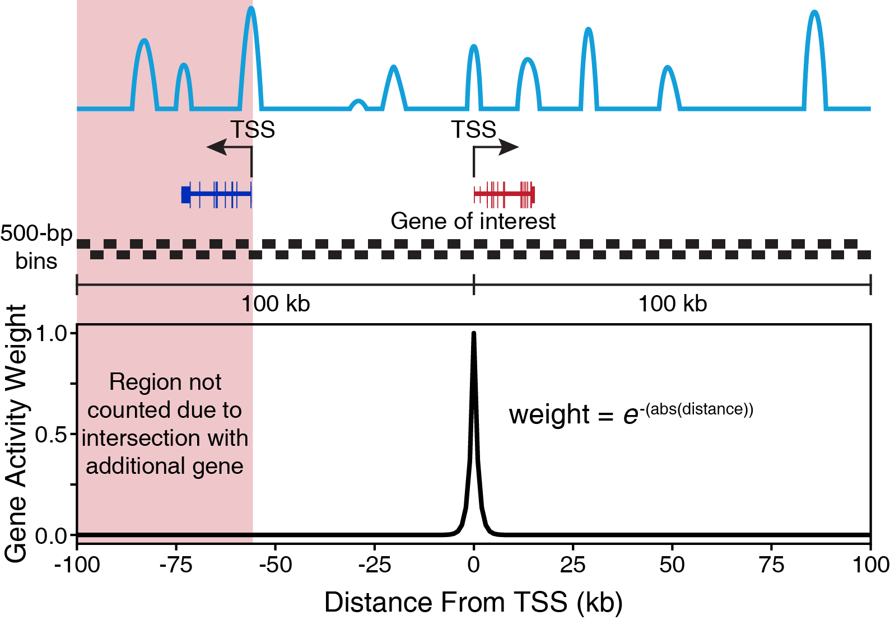

```{r image, include=FALSE}
knitr::include_graphics(c("../../images/GeneActivityScore_Schematic.png"))
```

### Gene Activity Scores

While ArchR is able to robustly call clusters, it is not possible to know _a priori_ which cell type is represented by each cluster. This task is often left to manual annotation because every application is different.

To do this cell type annotation, we use prior knowledge of cell type-specific marker genes and we estimate _gene activity scores_ for these genes. A gene activity score is essentially a prediction of how highly expressed a gene will be based on the accessibility of regulatory elements in the vicinity of the gene promoter.

Specifically, the 200-kb region centered on the given TSS is tiled into 1000-bp bins and the insertions per bin are counted. Each of these bins is then weighted proportional to the distance from the TSS because regulatory elements closer to the promoter are more likely to affect the promoter.

{width=500px}

$~$

These gene activity scores are calculated for each `ArrowFile` at the time of creation if the parameter `addGeneScoreMat` is set to `TRUE` (the default) or at any time by using the `addGeneScoreMatrix()` function. Once caluclated, individual cells of a UMAP projection can be colored by their gene activity scores to help with the identification of various cell types. For example, in the plot below from the tutorial, __QQQ__ cells are highlighted based on their gene activity scores for __QQQ__.

[INSERT UMAP GENE SCORE PLOT FROM PBMCs]

It is important to note that not all genes behave well with gene activity scores. In particular, genes that reside in very gene-dense areas can be problematic because the promoter accessibility of nearby genes contribute to their score and it is also not necessarily true that nearby regulatory elements will affect their expression. Thus, it is always best to sanity check all gene activity score analyses.

